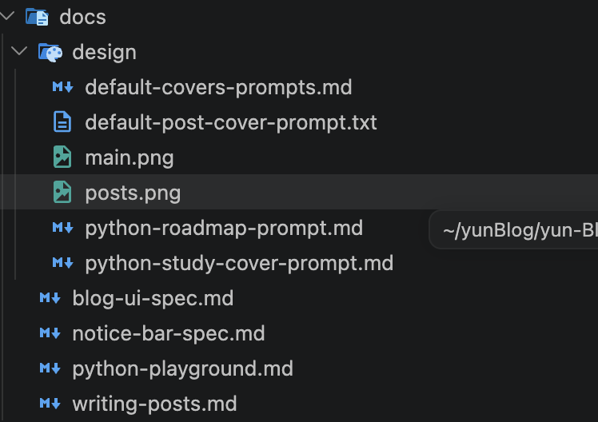
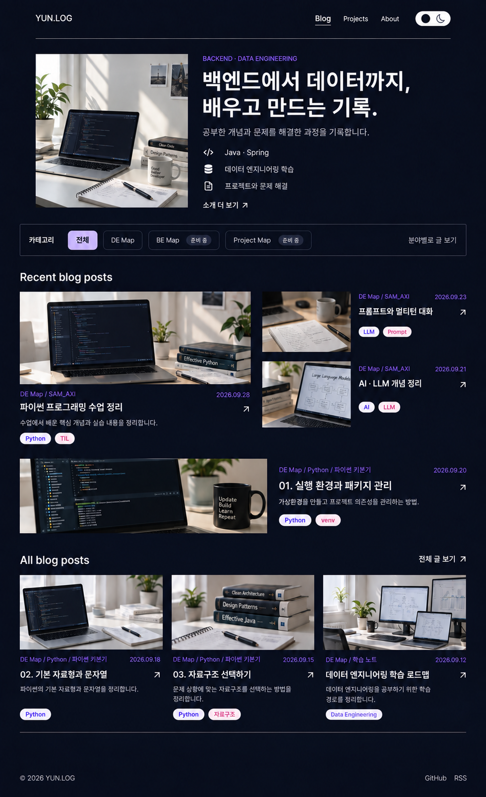

## 블로그 구현 계기

첫 블로그는 [velog](https://velog.io/@dbswns1101/posts)에서 코딩/개발 스터디가 시작이었다.  
근데 취업 후 블로그 작성에 소홀해져 한동안 블로그에 거미줄이 쳐짐;  

AI가 발전하여 여러 **바이브 코딩 어플, 웹, 프로그램**이 개발되는거 보니까  
블로그 정도는 아무것도 아니겠는데?  이전부터 나만의 블로그를 개발하고 싶기도 했고, 남들처럼 AI를 활용해 무언가를 만들어보고 싶었다.

근데 나땐 AI로 바이브 코딩 개발?  
23년도 GPT는 말귀를 잘 못알아 먹었다.  
한국 대통령이 윤석열이라 했는데도 자꾸 문재인이라고 해서 openAI 사상이 의심되기도 했다.  

이런걸로 바이브 코딩은 상상만 했는데 이루어질줄은 몰랐다.  

아무튼 내가 원하는 블로그 필수항목은 3가지였다

    1. 내가 원하는 형태로 UI 디자인
    2. 내가 폴더 구조에 맞게 정리한 구성을 그대로 블로그에서도 펼쳐 보일 수 있게 (계층별로 구분)
    3. 간단 요약 포트폴리오로도 표현할 수 있게

이를 그대로 구현하는건 어렵진 않았지만 그래도 엄청 쉽진 않았다.

### 내가 블로그를 구현한 순서는

1. `Git Page`를 사용한 FrameWork 저장소 생성 및 자동 빌드 Git Action 미리 구현
2. `codex`에게 내가 원하는 형태 블로그 설계도를 md 파일로 제공
3. `figma`, `dribbble`, `mobbin` 등 참고할만한 Blog UI 템플릿으로 저장
4. 내가 원하는 형태로 figma에 간단한 목업 생성
5. 1~3번을 제공하여 `구현 가능 여부 체크`
6. 가능하면 `종합적인 설계도`를 md 파일로 만들게 요청
7. `6번 파일 직접 검증` 후 실제 개발 요청
8. 검증-수정 후 배포

사실 **사진만 주고 개발해줘** 이렇게 하고 싶긴 했는데 개인적으로 바이브 코딩할땐  
내가 잡은 MVP 범위 만큼은 상세하게 설계도를 그린 후 개발을 해야  
나중에 수정이나 재사용이 수월하다고 생각했다.  

뭐 그렇다고 딸깍하는거랑 상세하게 설계도를 그리는거를 비교하진 않았지만

원하는 형태 그대로 나와 추가적인 검증하는데 시간을 절약할 수 있었다. (요즘엔 하네스가 잘 짜여져서일지도)

### 블로그 기능 실제 구현 적 작성 한 md 파일목록

### 구현 후

실제로 내가 디렉토리, md파일만 만들면 포스트가 가능했고,  
디렉토리 구조도 자연스럽게 구성됐다.

다음엔 파이썬 편집창, 출력창 (시각화 그림도) 구현, 뉴스 자동 리포트 기능을 추가할 생각

### 느낀 점

- 결과물 수정 방식도 AI가 잘 인식하게끔 하는게 중요하다고 생각했다  
  **처음 시안 디자인** 
  
  
  처음 UI 시안이 나올 땐 쓸대없이 들어간 요소들이 많았음  
  그래서 사진에 수정, 삭제할 부분을 빨간색으로 표시하여 수정 작업을 진행함
- 코드를 아얘 몰라도 되지만 **어디에 뭐가 뿌려지고, 가공되는지 알면 편하다**.
    - 사소한 부분을 수정하는데 AI를 쓰게되면 토큰이 낭비됨
    - 적당한 부분까지만 이해하면 내가 직접 수정하면 되니 낭비되는 토큰이 적어짐
- 지속적인 검증은 필수
- 그래도 토큰을 아낄려면 최대한 프롬프트를 간결하게 작성해야되는데 이 부분은 많이 부족하다고 생각됨