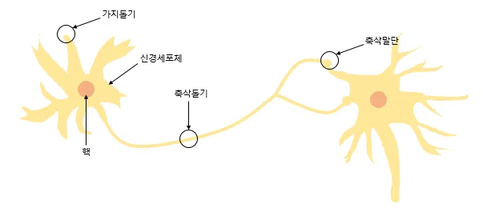
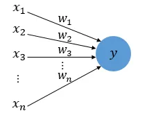
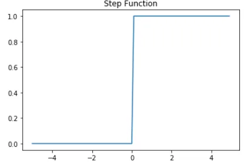

## 딥 러닝 개요

딥 러닝은 머신러닝의 특정한 분야로 `인공 신경망`의 층을 연속적으로 깊게 쌓아올려 데이터를 학습하는 방식

인공 신경망은 수 많은 머신 러닝 방법 중 하나였으나 인공 신경망을 복잡하게 쌓아 올린 딥 러닝이 출두되며  
머신러닝과 딥러닝을 구분해서 이해해야 한다는 의견이 생김.

## 1. 퍼셉트론(Perceptron)
초기의 인공 신경망으로 다수의 입력으로부터 하나의 결과를 내보내는 알고리즘  

퍼셉트론은 실제 뇌를 구성하는 신경 세포 뉴런의 동작과 유사한다. 아래 그림을 통해 알아보자.  

뉴런 가지돌기에서 신호를 받아들이고, 이 신호가 일정치 이상의 크기를 가지면 축삭돌기를 통해 신호를 전달한다.  

다수의 입력을 받는 퍼셉트론 그림을 보자.

`x`는 입력값을 의미. `w`는 가중치, `y`는 출력값이다.  
그림 안의 원은 **인공 뉴런**에 해당한다.  
실제 신경 세포 뉴런에서의 신호를 전달하는 축삭돌기의 역할을 퍼셉트론에서는  
**가중치가 대신한다.**

각각의 **인공 뉴런에**서 보내진 입력값 `x`는 각각의 가중치 `w`와 함께 종착지인 **인공 뉴런**에 전달된다.  

이때 **가중치**의 값이 크면 클수록 해당 입력 값이 중요하다는 의미.
> 입력 값 크기를 단순하게 맞춘 선형 모델은 가중치가 높을수록 입력 변화에 더 민감할 수있음.  
**그러나** 은닉층이 있는 신경망은 여러 뉴런과 경로를 거침  
가중치 하나만 보고 중요하다 판단하기 어려움

> **가중치** : AI가 입력하는 정보의 중요도를 높이기 위한 중요도 점수

퍼셉트론은 각 **입력값과 가중치를 곱하여** 인공 뉴런에 보내지고,  
각 입력값과 그에 해당하는 **가중치의 곱의 전체 합이 임계치를 넘으면** 종착지에 있는 인공 뉴런은 출력신호 1을 출력. 아니면 0을 출력.  

이런 함수를 계단 함수하며 아래는 계단 함수의 하나의 예다.

이때 계단 함수에 사용된 이 임계치 값을 수식으로 표현 시 보통 세타(Θ)로 표현
> 예를 든 수식 : 계단 함수에서 가중합과 임계치를 비교하는 경우를 표현한 수식  
`xw > Θ => 1` 

위 임계치를 좌변으로 넘기면(양쪽에 임계치를 뺌) 편향 b 로 표현할 수 있음.  
편향 b는 퍼셉트론 가중합에 추가되는 상수 값.
>`xw - Θ > Θ - Θ => 1`  
`xw + b(-0를 의미) > 0 => 1` 

예를들어 임계치(`Θ`)가 85, 가중합(`xw`)이 90인 경우 아래 값은 참이 된다.
> `90 + (-85) > 0 => 1` 

### 편향 b?

### 활성화 함수?